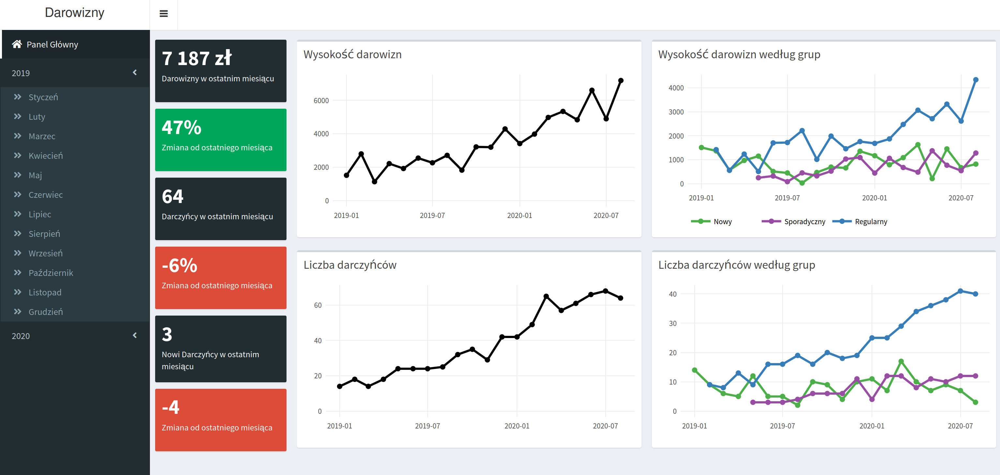
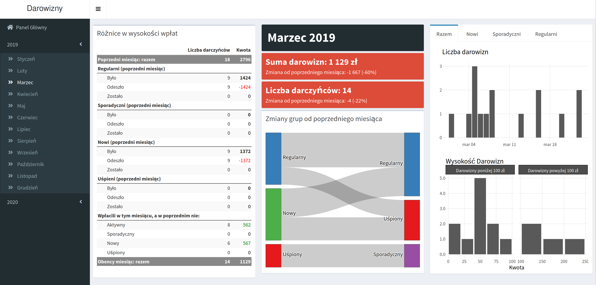

# Donations dashboard

Proof of concept for a dashboard presenting how do attitudes of NGO donors change in time. Given list of donations like one below

| Donor ID | Date       | Amount |
| -------- | ---------- | :----- |
| 3773     | 2020-08-01 | 120    |
| 8890     | 2020-08-03 | 25     |
| 3773     | 2020-09-07 | 110    |
| ...      | ...        | ...    |

the underlying Hidden Markov Model classifies each donor in each month as either *New, Regular, Occasional* or *Dormant*. Transitions between those groups and their consequences are then visualized with interactive plots and tables.

## Demo 

Menu is in Polish.





## Setup

Requirements: 

- Docker,
- R with packages `dplyr`, `tidyr`, `tibble`,`TraMineR`, `seqHMM`,`config`, `RPostgres` and `DBI`.


1. Setup credentials in files `application.yml`, `app/config.yml`, `db/01_init.sh`. Default values will be fine for presentation purposes.

2. Create network:

   ```bash
   docker network create --driver bridge donationsbridge`
   ```

3. Build database image (use a name of your choice)

   ```bash
   cd db
   docker image build -t aczepielik/donationssql:latest .
   ```

4. Run database container connected to `donationsbridge` with port `5432` exposed

   ```bash
   docker container run -d -p 5432:5432 -e POSTGRES_PASSWORD=postgres --network donationsbridge --name=postgres aczepielik/donationssql:latest
   ```

5. Fit the model and populate database with inferred states (eventually this step will be part of the app itself).

   ```bash
   cd ../app
   Rscript scripts/backend/model_local_write.R
   ```

6. Build application image (use a name of your choice but remember to be consistent with `application.yml`)

   ```bash
   docker image build -t aczepielik/donations:latest .
   ```

   Make a tea or something; it takes some time to compile all the packages.

7. Build a ShinyProxy image for scaling

   ```bash
   cd .. #back to the main folder
   docker image build -t aczepielik/donationsproxy:latest .
   ```

8. Run ShinyProxy container

   ```bash
   docker container run -d -v /var/run/docker.sock:/var/run/docker.sock --net donationsbridge -p 8080:8080 aczepielik/donationsproxy:latest
   ```

   